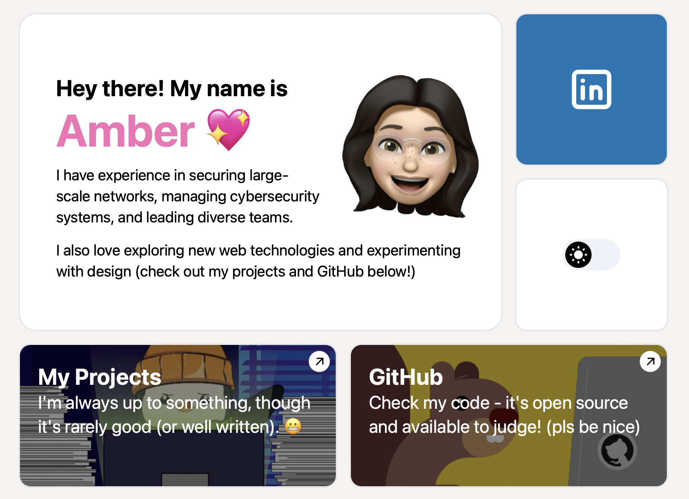

# Personal Portfolio (V4)

[](https://astro.build) [](https://github.com/ambercaravalho/personal-site-v4/actions/workflows/astro-deploy-to-github-pages.yml)



<div align="center">

### [Visit the Live Site ➡️](https://ambercaravalho.github.io/personal-site-v4/)

</div>

## Overview 🖥️

Welcome to the fourth iteration of my personal portfolio site! Every six months, I get inspired by a new design and completely revamp my site. This version is built with [Astro](https://astro.build), a framework that has made integrating React components much easier (or so I've heard). 

You can take a look back at previous versions on the [projects page](https://ambercaravalho.github.io/personal-site-v4/projects#personal) of my site.

## Purpose 🌟

This project is (supposed to) help me grow as a developer. With each new version, I aim to learn and implement new technologies and design principles. This time, I’ve chosen Astro for its ease of use and modern capabilities. My portfolio showcases my projects, LinkedIn, GitHub, and an About Me section, all arranged in a bento box grid style.

## Setup Guide ⚙️

To get this project up and running on your local machine, follow these steps:

1. Clone the repository:
    ```sh
    git clone https://github.com/ambercaravalho/personal-site-v4.git
    ```
2. Navigate to the project directory:
    ```sh
    cd personal-site-v4
    ```
3. Install the dependencies:
    ```sh
    npm install
    ```
4. Start the development server:
    ```sh
    npm run astro dev
    ```

You should now see the site running locally. Feel free to explore, modify, and learn from it!

## Future Plans 🚀

As I continue to evolve this portfolio, I plan to:

- [ ] Create information pages for each project.
- [ ] Develop animations for widgets upon page load.
- [ ] Add a footer to each page.

Thanks for checking out my project! Any feedback or suggestions are welcome.
